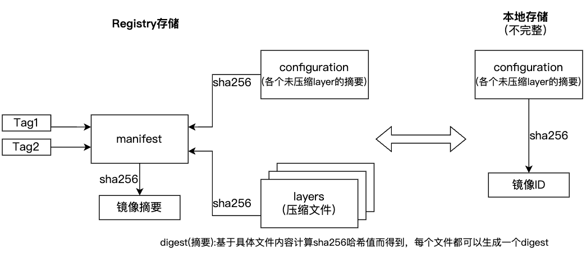
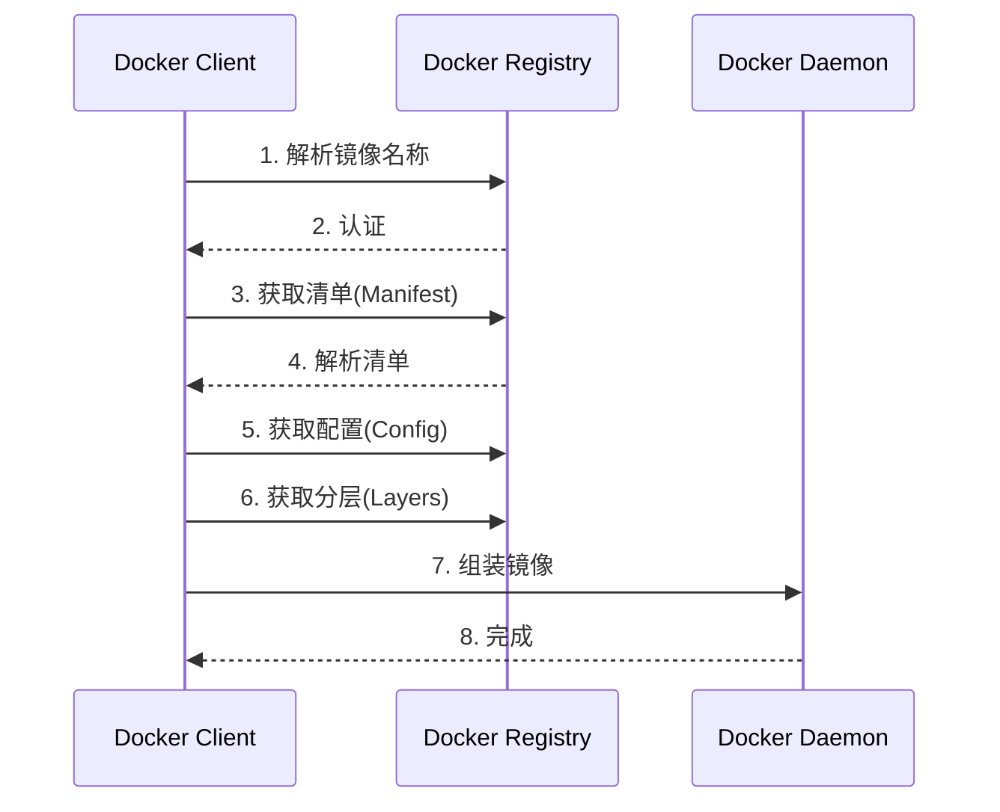
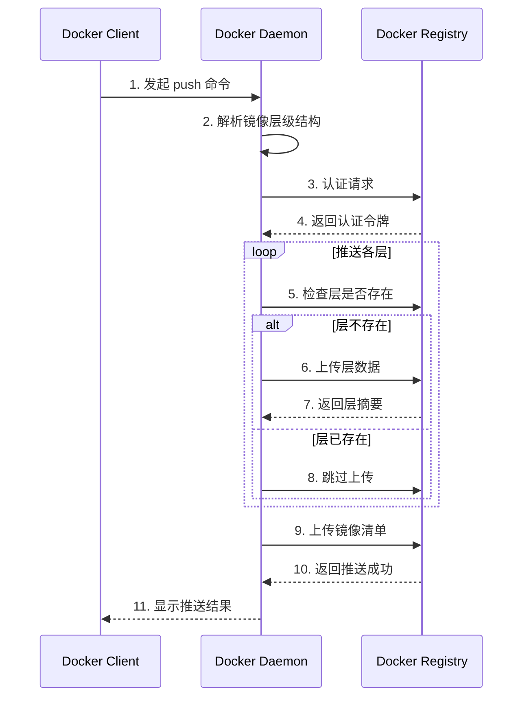
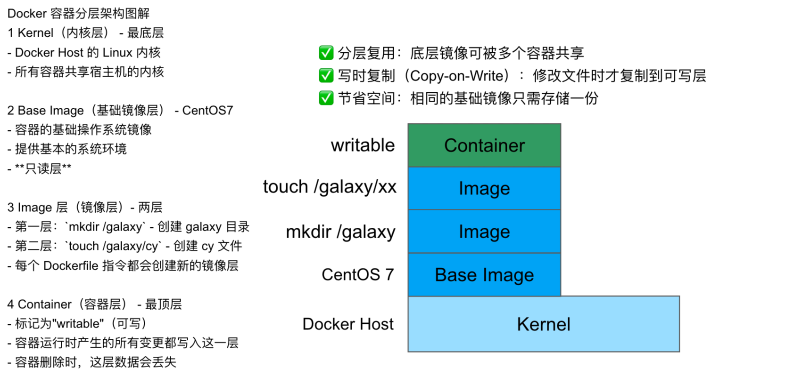
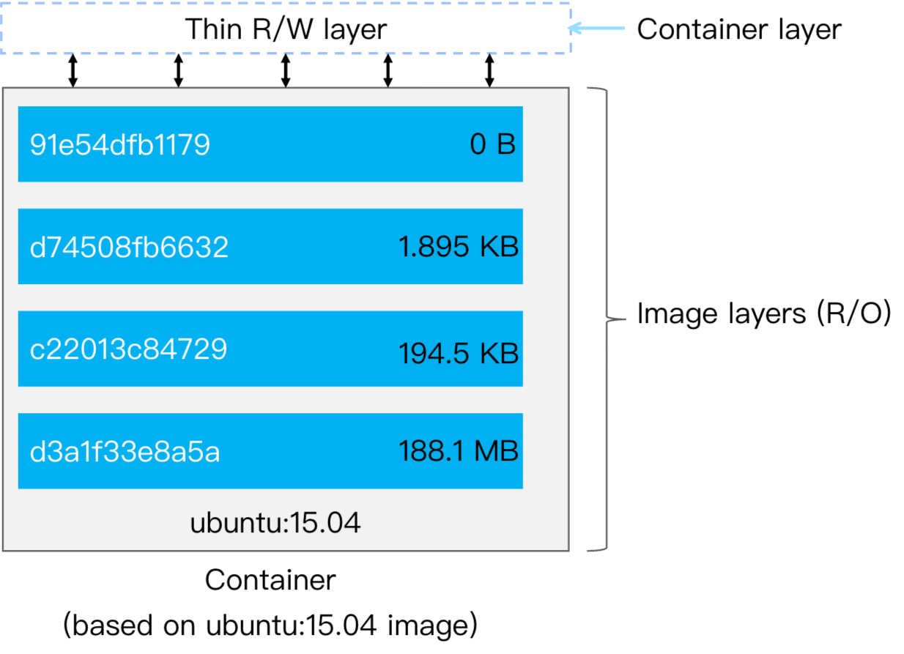

# Docker 基础

CNB 云原生开发环境中已经预装了 Docker，无需手动安装，直接体验即可。

## 查看 Docker 信息
```shell
docker version  # 查看版本信息
docker info     # 查看运行时信息
```

## 运行第一个容器：hello-world
```shell
docker run hello-world
```
> 学习一门新语言，第一个程序是输出 hello world！  
> 学习 Docker，第一个容器运行输出 hello from Docker！

## 案例：运行 Alpine Linux 容器
> **扩展知识**：  
> Alpine 镜像在企业生产环境中被广泛应用：
> - 极简的 Linux 发行版
> - 只包含基本命令和工具
> - 镜像体积小（约 8MB）
> - 内置包管理系统 `apk`
> - 常用作其他镜像的基础

### 镜像操作
#### 1. 拉取镜像
```shell
# 拉取 alpine 镜像，默认以 latest 标签拉取
docker pull alpine
```

#### 2. 查看镜像
```shell
docker image ls
```
镜像格式：`<repository>/<image>:<tag>`
- `repository`: 镜像仓库（默认 Docker Hub）
- `image`: 镜像名称
- `tag`: 镜像标签（默认 latest）

完整镜像示例：
```shell
docker.cnb.cool/coldenn/docker-open-camp/docker-exercises/my-alpine:latest
```
- Repository: `docker.cnb.cool`
- Image: `coldenn/docker-open-camp/docker-exercises/my-alpine`
- Tag: `latest`

#### 3. 镜像可见性
镜像分为两种类型：
- **Public**：无需登录即可拉取
- **Private**：需要登录后才能拉取

```shell
# 公开镜像（正常拉取）
docker pull docker.cnb.cool/coldenn/docker-open-camp/docker-exercises/my-alpine:latest

# 私有镜像（拉取失败）
docker pull docker.cnb.cool/docker-open-camp/private-repo/my-alpine
```

#### 4. 登录镜像仓库
```shell
docker login [-u ${username}] [-p ${password}] ${repository}
```

#### 5. 删除镜像
```shell
docker image rm ${image_id}
```

#### 6. 查看镜像历史
```shell
docker history ${image_id}
```

### 容器操作
#### 1. 运行容器
```shell
docker run alpine
```

#### 2. 查看容器
```shell
docker ps
```
> **问题**：为什么看不到刚启动的容器？  
> **原因**：容器没有前台进程会立即退出

查看所有容器（包括已停止的）：
```shell
docker ps -a
```

#### 3. 交互式运行容器
```shell
docker run -it alpine  # 等效于 docker run -it alpine /bin/sh
```
参数说明：
- `-it`：分配交互式终端（interactive + TTY）
- `-d`：后台运行容器（detached mode）

`run -it` 命令会启动一个交互式终端，退出终端后容器也会停止，如果希望容器在后台运行，可以使用 -d 参数

#### 4. 后台运行容器
```shell
docker run -d alpine 
```

#### 5. 进入运行中的容器
```shell
docker exec -it <container_id> /bin/sh
```
进程查看示例：
```text
/ # ps -ef
PID   USER     TIME  COMMAND
    1 root      0:00 /bin/sh
   13 root      0:00 /bin/sh
   19 root      0:00 ps -ef
```

PID=1 的进程为 /bin/sh， 而另一个 /bin/sh 进程则是我们通过 exec 命令启动的，这个进程退出不会影响 PID=1 的进程，也就不会导致容器的退出

#### 6. 替代进入方式（不推荐）
```shell
docker attach <container_id>
```
> **注意**：  
> attach 会接管 PID=1 的进程，如果该进程退出，容器也会退出

#### 7. 查看容器详情
```shell
docker inspect alpine
```

##### 8. 查看容器日志
```shell
docker logs <container_id>
```

## 拓展
### OCI镜像规范
OCI 定义的镜像包括4个部分：镜像索引（Image Index）、清单（Manifest）、配置（Configuration）和层文件（Layers）。镜像索引是镜像中可选择的部分，一个镜像可以不包括镜像索引。如果镜像包含了镜像索引，则其作用主要指向镜像不同平台的版本，代表一组同名且相关的镜像，差别只在支持的体系架构上。

### Docker 镜像存储


### Docker pull 和 Docker push 发生了什么

#### Docker pull


#### Docker push


### 镜像分层 OverlayFS



1. OverlayFS 的核心概念

OverlayFS 是一种 联合文件系统（Union Filesystem），它通过 堆叠多层目录 实现文件系统的叠加，主要分为：

• Lower Dir（镜像层）：只读的基础层（可以是多个，对应 Docker 镜像的每一层）。

• Upper Dir（容器层）：可写层，容器运行时新增或修改的文件会存储在这里。

• Merged Dir（合并视图）：用户看到的最终统一文件系统，是上下层叠加后的结果同名文件覆盖 访问文件时，优先从 upperdir 读取

2. OverlayFS 的工作示例

假设镜像层（lowerdir）有一个文件 /galaxy，而容器层（upperdir）也创建了同名文件：
```
# 镜像层（只读）
lowerdir/
    └── galaxy    # 内容："Hello from image"

# 容器层（可写）
upperdir/
    └── galaxy    # 内容："Hello from container"

# 用户看到的合并视图
merged/
    └── galaxy    # 实际显示 "Hello from container"（上层覆盖下层）
```
当删除容器层的 galaxy 文件时：
容器层会创建 whiteout 文件
```
upperdir/ 
    └── galaxy # 特殊字符文件表示删除

合并视图
mergeddir/ 
    └── galaxy # 文件消失（实际被隐藏）
```

3. Docker 如何使用 OverlayFS

• 镜像层：Docker 镜像的每一层（如 FROM alpine, RUN apk add）都是 lowerdir。

• 容器层：启动容器时创建的 upperdir 是可写层，存储所有运行时修改。

• 性能优化：OverlayFS 通过 写时复制（Copy-on-Write） 避免直接修改镜像层，提升效率。



4. 验证 Docker 的存储驱动

运行以下命令查看 Docker 是否使用 OverlayFS：
```
docker info | grep "Storage Driver"
```

输出示例：
```
Storage Driver: overlay2
```