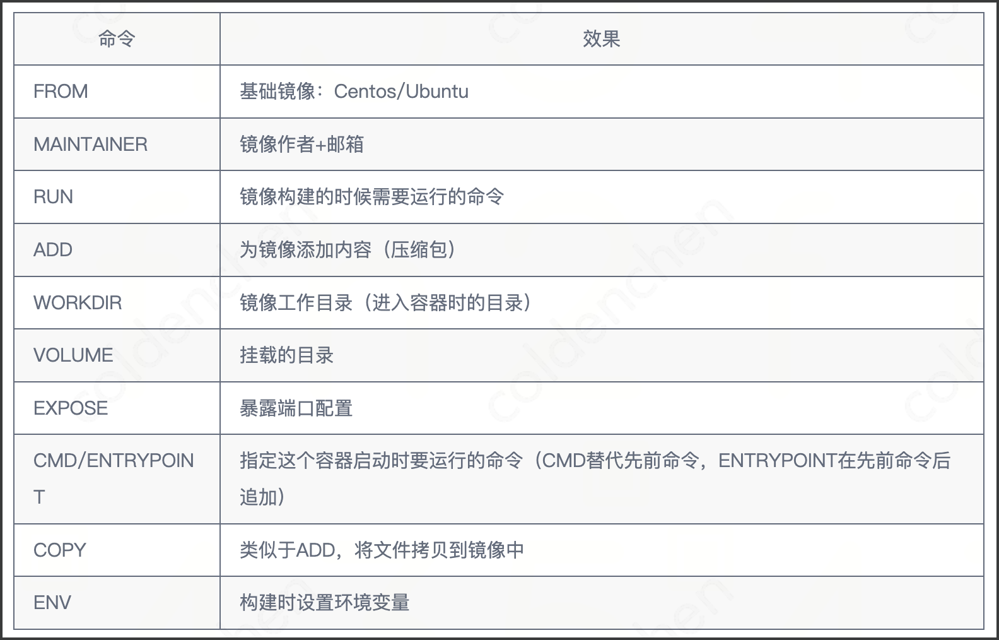

# 自定义镜像之 Dockerfile 详解

上节课我们学习了Docker概述，并实操理解了 Docker 三个核心概念：镜像、容器、仓库。
并且我们已经会使用 Docker 官方提供的镜像，启动容器。

但是这些镜像不能满足我们的需求，比如想定制一个个性化的环境，安装一些特定的软件，这个时候就需要我们自定义镜像。

本节课我们会学习两种自定义镜像的方式，一种是命令式创建镜像，一种是声明式创建镜像。
我们先从最简单的镜像创建方式开始，命令式创建镜像。
## 命令式创建镜像（从容器创建镜像）

案例：创建一个自定义镜像，基于alpine镜像，并安装figlet工具。
（figlet：输出艺术字符串的小工具）

<!-- 1. 启动一个基础容器 -->

``` shell
docker run -it --name alpine alpine
```
<!-- 2. 向容器中安装 figlet 工具-->
然后我们进入容器，在容器中执行一些命令（安装一个软件），然后退出容器。
```shell inside container
docker exec -it alpine /bin/sh
apk update
apk add figlet
exit
```
这样，我们就在 alpine 容器中安装了 figlet 工具。

<!-- 3. 保存容器为镜像-->
然后我们需要将这个新的容器环境跟其他人分享，我们可以通过 commit 命令将容器保存为一个镜像。
```shell
docker ps -a #查看容器
docker commit ${container_id} alpine-figlet
```
这样，我们就创建了一个名为alpine-figlet的镜像

<!-- 4. 使用镜像 -->
最后我们就可以使用这个新的镜像了, 运行体验下艺术字生成的效果。
```shell
docker run alpine-figlet figlet "hello docker"
```

<!-- 5. 推送镜像-->
最后我们也可以使用 `docker push` 命令将镜像推送到镜像仓库中，其他人便可以使用 `docker pull` 来使用这个镜像了。

上述从容器创建镜像的方式虽然简单易懂，但是考虑真实项目中，我们可能需要安装很多工具，比如 git，vim，curl，wget 等等。如果我们每次都使用这种方式来创建镜像，就会非常麻烦，并且容易出错。

### 命令式创建的局限性
1. **不可重复性**：容器安装过程依赖人工操作，无法保证环境一致性
2. **臃肿镜像**：容器可能包含临时文件/缓存，导致镜像体积膨胀
3. **安全风险**：无法追溯安装过程，可能存在安全隐患
4. **维护困难**：无法版本化管理构建步骤


因此，我们需要一种更加方便的镜像创建方式，这就是 Dockerfile。


## 声明式创建镜像（Dockerfile）


我们来使用 [Dockerfile](./Dockerfile) 来自定义一个同样的镜像。它的格式是：

``` shell
docker build -t alpine-figlet-from-dockerfile .
docker run alpine-figlet-from-dockerfile figlet "hello docker"
```

这样当我们需要安装 git 的时候，只需要修改 Dockerfile 中的命令后重新构建镜像即可。

```shell
docker build -t alpine-figlet-from-dockerfile .
docker run alpine-figlet-from-dockerfile git
```


## 小结
关于Dockerfile，上节课我们介绍部署技术历史中提及过，它的出现，帮助 Docker 成为容器化时代下最受欢迎的方案
### 那它到底是什么呢？
Dockerfile是一种静态文件，用来声明镜像的内容。
### Dockerfile 为什么如此重要呢？
Dockerfile给容器化实践提供了一种规范，让创建镜像的操作简单化，标准化。
简单化让开发者可以快速上手，标准化让镜像可以重复使用，可移植，可复用。这些好处从侧面上推动了 Docker 的普及。


# Dockerfile实践&关键语法介绍 

为了上手书写 Dockerfile，我们还要学习它的语法。我们用两个🌰。

## 使用 Dockerfile 构建一个 jupyter notebook 镜像

让我们使用 Docker 来构建一个真实可用的镜像，比如 jupyter notebook 镜像。[Dockerfile](./jupyter_sample/Dockerfile)

```shell
docker build -t jupyter-sample jupyter_sample/
```

该镜像使用 RUN 指令来安装 jupyter notebook，使用 WORKDIR 指令设置工作目录，
使用 COPY 指令将代码复制到镜像中，使用 EXPOSE 指令来暴露端口，
最后使用 CMD 指令来启动 jupyter notebook 服务。

使用上述镜像来启动 jupyter notebook 服务。

```shell
docker run -d -p 8888:8888  jupyter-sample
```

我们使用了 -p 参数来将容器内的 8888 端口映射到宿主机的 8888 端口，在 cnb 上我们可以通过添加一个端口映射来实现外网访问。


点击这个浏览器图标，就可以访问 jupyter notebook 服务了。


## 使用多阶段构建来打包一个 golang 应用

在实际开发中，我们经常需要构建 golang 应用。
如果使用传统的单阶段构建，最终的镜像会包含整个 Go 开发环境，导致镜像体积非常大。
通过多阶段构建，我们可以创建一个非常小的生产镜像。

创建一个 [main.go](./golang_sample/main.go) 文件，
一个普通构建的 [Dockerfile](./golang_sample/Dockerfile.single)
以及一个多阶段构建的 [Dockerfile](./golang_sample/Dockerfile.multi)

构建镜像：

```shell
docker build -t golang-demo-single -f golang_sample/Dockerfile.single golang_sample/
docker build -t golang-demo-multi -f golang_sample/Dockerfile.multi golang_sample/
```

运行容器：

```shell
docker run -d -p 8080:8080 golang-demo-single
docker run -d -p 8081:8081 golang-demo-multi
```

容器运行成功后可以通过如下命令行来访问，可以看到两个容器都是在运行我们写的 golang 服务。

```shell
curl http://localhost:8080
curl http://localhost:8081
```

让我们来对比一下单阶段构建和多阶段构建的区别：

```shell
# 查看镜像大小
docker images | grep golang-demo
```

你会发现最终的镜像只有几十 MB，而如果使用单阶段构建（直接使用 golang 镜像），镜像大小会超过 1GB。这就是多阶段构建的优势：

- 最终镜像只包含运行时必需的文件
- 不包含源代码和构建工具，提高了安全性
- 大大减小了镜像体积，节省存储空间和网络带宽

这种构建方式特别适合 Go 应用，因为 Go 可以编译成单一的静态二进制文件。在实际开发中，我们可以使用这种方式来构建和部署高效的容器化 Go 应用。

## Dockerfile 命令


### 构建过程

- 每个保留关键字（指令）都必须是大写字母
- 从上到下顺序执行
- "#" 表示注释
- 每一个指令都会创建提交一个新的镜像层并提交

### CMD 和 ENTRYPOINT 的区别
- CMD             # 指定这个容器启动的时候要运行的命令，只有最后一个会生效可被替代
- ENTRYPOINT      # 指定这个容器启动的时候要运行的命令， 可以追加命令

### Dockerfile 优化技巧
- **层合并**：合并 RUN 指令减少镜像层数
    ```dockerfile
    RUN apk update && \
        apk add --no-cache figlet git && \
        rm -rf /var/cache/apk/*
    ```
- **多阶段构建**：构建多个镜像层，最后只保留最终的镜像层
- 使用 .dockerignore 文件来忽略不需要的文件
- 避免硬编码敏感信息，而是使用环境变量
    ``` 
    ARG DB_PASSWORD
    ENV DB_PASSWORD=${DB_PASSWORD}
    ```
- 使用特定版本的基础镜像，避免因基础镜像更新导致的不稳定性
    ```
    FROM alpine:3.14  # 明确指定版本
    ```