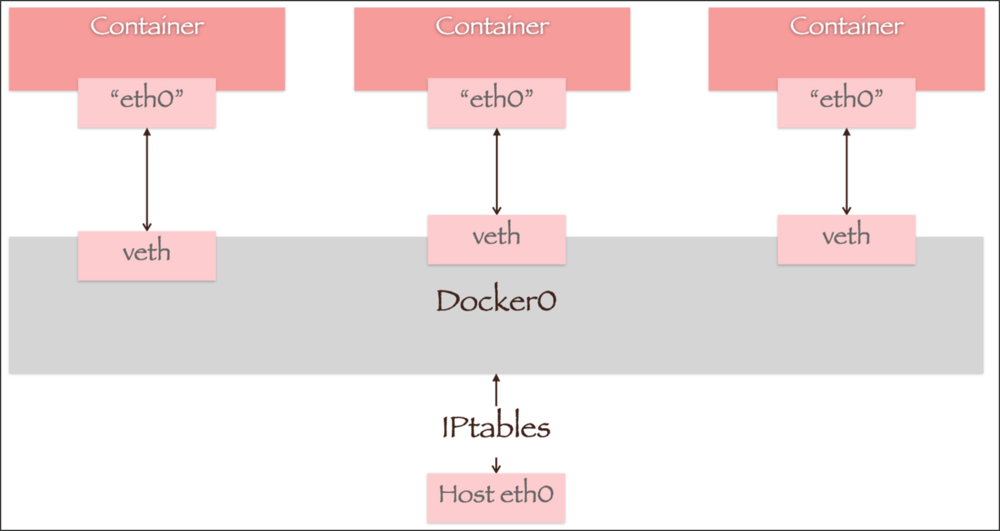

# Docker 网络管理详解

Docker 网络是容器通信的基础设施，它使容器能够安全地进行互联互通。在 Docker 中，每个容器都可以被分配到一个或多个网络中，容器可以通过网络进行通信，就像物理机或虚拟机在网络中通信一样。

## Docker 网络命令详解 

在开始学习不同类型的网络之前，我们先来了解一下 Docker 的常用网络命令：

```shell
# 列出所有网络
docker network ls

# 创建自定义网络
docker network create [options] <network-name>

# 检查网络详情
docker network inspect <network-name>

# 将容器连接到网络
docker network connect <network-name> <container-name>

# 断开容器与网络的连接
docker network disconnect <network-name> <container-name>

# 删除网络
docker network rm <network-name>

# 删除所有未使用的网络
docker network prune
```

## 网络类型及实践案例

### 容器默认网络

新创建一个容器时，他会默认连接到一个叫“默认Bridge”的网络。而所有链接该网络的容器可以通过这座“桥梁”通信。

Q：这个“默认Bridge网络”是什么？是谁创建的？它的通信原理是？

A：它是由Docker自动创建的，它是一个名为“docker0”的Linux网桥(使用`ip addr`命令可以看到)，功能上就像是一个虚拟的交换机，将容器相互连接，容器之间可以通过这个网桥进行通信。
   连接到它的每个容器都会被分配一个IP地址，相互之间可以通过IP地址进行通信。
   

Q：除了Bridge网络，还有哪些网络类型？

A：除了Bridge网络，Docker还支持Host网络、None网络和自定义网络。Host网络直接将容器连接到主机网络，None网络禁用了容器的网络功能，自定义网络则允许用户创建自己的网络。这些网络类型各有优缺点，可以根据实际需求选择使用。 接下来，我们将分别介绍这些网络类型及其实践案例。

### 1. Bridge 网络

#### 实践案例一：默认 Bridge 网络

让我们先来看看默认 bridge 网络的行为：

```shell

# 启动两个nginx容器
docker run -d --name container1 nginx
docker run -d --name container2 nginx

# 查看默认bridge网络的ID
# docker network ls
# docker network inspect bridge -f '{{.ID}}'

# # 查看容器是否连接到默认bridge网络？
# docker network inspect bridge -f '{{.Containers}}'
# docker inspect container1 -f '{{range .NetworkSettings.Networks}}{{.NetworkID}}{{end}}'
# docker inspect container2 -f '{{range .NetworkSettings.Networks}}{{.NetworkID}}{{end}}'

# 查看容器的IP地址
docker inspect container1 -f '{{range .NetworkSettings.Networks}}{{.IPAddress}}{{end}}'
docker inspect container2 -f '{{range .NetworkSettings.Networks}}{{.IPAddress}}{{end}}'

# 进入容器1，尝试通过 IP 访问容器2
docker exec -it container1  curl http://172.17.0.3


# 注意：在默认 bridge 网络中，无法通过容器名称访问
docker exec -it container1  curl http://container2  # 这将失败

# # 精简镜像可能没有 ip/ifconfig：可以临时安装
# Debian/Ubuntu：apt-get update && apt-get install -y iproute2
```
不过，默认bridge的网络下，容器之间只能通过 IP 地址互相访问，不支持通过容器名称来通信。
通过IP访问，需要记住容器的IP地址，这显然不是个好办法。

#### 实践案例二：自定义 Bridge 网络

为了解决这个限制，Docker 提供了用户自定义 bridge 网络的功能。
通过创建自定义 bridge 网络，容器可通过稳定的名称直接互访，无需依赖 IP 地址，从而简化了记忆IP的难度。

接下来，我们在案例中使用自定义网络：尝试将两个容器连接到同一个网络，然后通过容器名称进行通信：
```shell
# 创建自定义 bridge 网络
docker network create \
    --driver bridge \
    my-bridge-network

# 启动两个容器，连接到自定义网络
docker run -d \
    --name custom-container1 \
    --network my-bridge-network \
    nginx

docker run -d \
    --name custom-container2 \
    --network my-bridge-network \
    nginx

# 现在可以通过容器名称访问
docker exec -it custom-container1 curl http://custom-container2
```


>   Docker 中默认的 `bridge` 网络与自定义 `bridge` 网络在容器名称解析上的差异，核心原因在于 **DNS 服务的启用机制** 和 **网络配置的隔离性**。默认的 `bridge` 网络（即 `docker0` 虚拟网桥）**不提供容器名称解析功能**。容器间若需通信，必须通过 IP 地址。因此默认网络下的容器 IP 可能因重启或容器重建而变化，导致依赖 IP 的通信失效。
>
>   而自定义 `bridge` 网络启用 Docker 内置的 DNS 服务器（`127.0.0.11`），容器可通过名称直接解析其他容器的 IP 地址。容器启动时，Docker 自动将 `/etc/resolv.conf`中的 DNS 服务器指向 `127.0.0.11`。
>
>   ```text
>   # Generated by Docker Engine.
>   # This file can be edited; Docker Engine will not make further changes once it
>   # has been modified.
>   
>   nameserver 127.0.0.11
>   options ndots:0
>   
>   # Based on host file: '/etc/resolv.conf' (internal resolver)
>   # ExtServers: [10.235.16.19 183.60.83.19 183.60.82.98]
>   # Overrides: [nameservers]
>   # Option ndots from: host
>   ```
>
>   而使用默认 bridge 网络创建的容器，`/etc/resolv.conf` 文件中的内容如下（ `nameserver` 是 Docker 引擎根据宿主机 DNS 配置自动生成的）：
>
>   ```text
>   # Generated by Docker Engine.
>   # This file can be edited; Docker Engine will not make further changes once it
>   # has been modified.
>   
>   nameserver 10.235.16.19
>   nameserver 183.60.83.19
>   nameserver 183.60.82.98
>   options ndots:0
>   
>   # Based on host file: '/etc/resolv.conf' (legacy)
>   # Overrides: [nameservers]
>   # Option ndots from: host
>   ```


### 2. Host 网络

Host 网络移除了容器和 Docker 主机之间的网络隔离，直接使用主机的网络。

**特点：**

- 最佳网络性能
- 直接使用主机的网络栈
- 没有网络隔离
- 端口直接绑定到主机上

实践案例：**使用 Host 网络运行 Nginx 服务器**

```shell
# 启动一个Nginx容器，使用host网络 (⚠️ 为了避免端口冲突， 容器1 启动alpine/curl即可)
docker run -itd \
    --name host1 \
    --network host \
    alpine \
    sh -c "apk add --no-cache curl && sh"
docker run -d \
    --name host2 \
    --network host \
    nginx

# 查询宿主机端口 eth0 是 HOST_IP
ifconfig 

# 登入容器1，通过宿主机ip访问容器2
docker exec -it host1 curl http://${HOST_IP}$:80


# 特别注意：因为容器使用主机的网络端口，而主机的端口一旦使用，就不能再被其他容器使用。否则会提示端口冲突。
docker run -d \
    --name host-3 \
    --network host \
    nginx
    
docker logs host-3
```


### 3. None 网络

None 网络完全禁用了容器的网络功能，容器在这个网络中没有任何外部网络接口。

**特点：**

- 完全隔离的网络环境
- 容器没有网络接口
- 适用于不需要网络的批处理任务

实践案例：**使用 None 网络运行独立计算任务**

```shell
# 运行一个计算密集型任务，不需要网络
docker run --network none alpine sh -c 'for i in $(seq 1 10); do echo $((i*i)); done'
```


### 4. Overlay 网络

Overlay 网络是 Docker 用于实现跨主机容器通信的网络驱动，主要用于 Docker Swarm 集群环境。
它通过在不同主机的物理网络之上创建虚拟网络，使用 VXLAN 技术在主机间建立隧道，从而实现容器间的透明通信。
在 Overlay 网络中，每个容器都会获得一个虚拟 IP，容器之间可以直接通过这个 IP 进行通信，
而不需要关心容器具体运行在哪个主机上。这种网络类型特别适合于微服务架构、分布式应用以及需要跨主机通信的容器化应用，
例如分布式数据库集群、消息队列集群等。Overlay 网络支持网络加密，能确保跨主机通信的安全性，
同时还提供了负载均衡和服务发现等特性，是构建大规模容器集群的重要基础设施。

## 5. macvlan/ipvlan 网络
让容器获得“局域网中的独立 IP”，适合对接传统网络；需网络环境与路由配置到位。


### 课后实践

#### 实际案例： 使用 自定义 Bridge 网络演示 Web 应用与 Redis 通信

自定义bridge网络 是目前docker网络通信中最常用的方式。
我们再通过一个 实际案例 来演示自定义bridge网络的使用。


```shell
# 创建web应用的镜像
docker build -t web-app web-app

# 创建 自定义bridge网络
docker network create my-bridge-network

# 启动 Web和Redis 容器
docker run -d \
    --name redis-server \
    --network my-bridge-network \
    redis:alpine
docker run -d \
    --name web-app \
    --network my-bridge-network \
    -p 5000:5000 \
    web-app
```

```shell
# 访问应用
curl http://localhost:5000

# 多次访问，观察计数器增加
curl http://localhost:5000
curl http://localhost:5000

# 查看 Redis 中的数据
docker exec -it redis-server redis-cli get hits
```

清理环境：

```shell
# 删除用到 my-bridge-network 网络的容器
docker rm -f web-app redis-server
docker rm -f custom-container1
docker rm -f custom-container2
# 删除自定义网络
docker network rm my-bridge-network
# 删除镜像
docker rmi web-app redis:alpine
```
