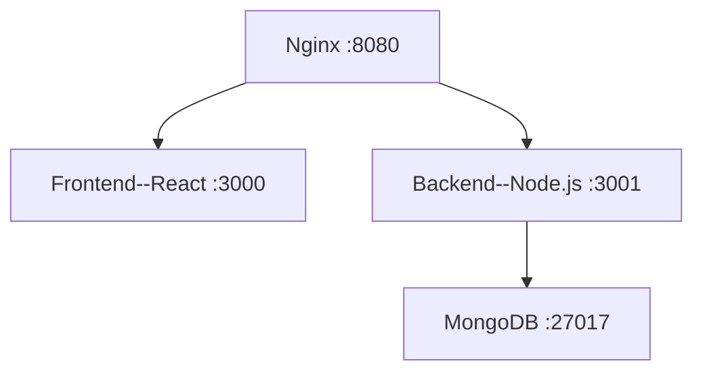

# Docker Compose 实践

## 1. 引言

在前面的课程中，我们学习了如何使用 Docker 容器来运行单个服务。
通过 `docker run` 命令，我们可以快速启动一个数据库、一个 Web 服务器或者一个缓存服务。这种方式在开发简单应用时非常有效。

然而，随着应用架构的演进，微服务的理念逐渐流行，一个应用由多个服务共同组成。

### 案例
本节课我们准备了 一个多服务的web应用 的案例如下：

#### web应用包含四个独立服务
- **Nginx**: 路由转发服务
- **前端**: React框架开发 提供前端页面服务
- **后端**: Node.js开发 提供后端API服务
- **数据库**: MongoDB 提供数据库服务

#### 应用架构
四个服务共同组成了应用，整体架构图如下：


试想一下，我们为了部署这个web应用，需要完成哪些工作？

- 1.为四个服务分别构建镜像
   - 1.1 拉取nginx镜像
   - 1.2 拉取mongodb镜像
   - 1.3 手动书写前端服务的 Dockerfile，构建镜像
   - 1.4 手动书写后端服务的 Dockerfile，构建镜像
- 2.配置容器见公共的基础设置
   如Docker网络、存储卷等
- 3.配置服务间的依赖关系
   如前端服务依赖后端服务，后端服务依赖数据库等 
- 4.启动容器

可以看到，随着工程复杂度的提升，服务数量增加，手动管理服务容器会变得越来越复杂。
这不仅增加了运维的复杂度，还增加了手动操作出错的概率。

所以我们需要一个工具来对多容器应用进行管理。 于是Docker Compose应运而生。


## 2. Docker Compose 简介

Docker Compose 是一个用于定义和运行多容器的工具。
它允许我们使用 YAML 文件来定义各容器，然后通过一个命令来启动所有服务。

### 核心步骤
#### 1）书写docker-compose.yml文件
   - 定义各个服务基本信息（如镜像、端口、环境变量等）
   - 定义网络、存储卷等通用设置
   - 定义服务之间的依赖关系
#### 运行
   - `docker compose up`: 创建和启动所有服务


## 3. docker-compose.yml语法

### 3.1 Yaml文件格式
Docker Compose 使用 YAML 文件来定义服务。
YAML 是一种人类可读的数据序列化语言，它支持多种数据类型，如字符串、数字、列表、映射等。
Docker Compose 使用 YAML 文件来定义服务，因此我们需要了解 YAML 的基本语法。
   - 用缩进表示层级关系，必须为偶数个空格
   - 三种基本类型：标量（单个值）、映射（键值对）、序列（列表）
    
### 3.2 docker-compose.yaml语法
#### docker-compose.yml详解
   - **服务 (Services)**: 容器的定义，包括使用哪个镜像、端口映射、环境变量等
   - **网络 (Networks)**: 定义容器之间如何通信
   - **卷 (Volumes)**: 定义数据的持久化存储
   - **依赖关系 (Dependencies)**: 定义服务之间的启动顺序
   - **环境变量 (Environment Variables)**: 管理不同环境的配置


## 4. Docker Compose 原理

流程：
1. 解析YAML文件
2. 检查/创建所需网络、卷
3. 创建和启动每个服务的容器
4. 统一管理生命周期
• 源码：https://github.com/docker/compose/blob/cb959100188e9bfa2a463d7b0a6e3e1679bd5d0f/pkg/compose/up.go#L39


## 5. 实践项目：使用 docker compose 构建 Todo 应用

### Docker Compose 配置解析

#### 服务定义

1. **nginx 服务**
   - 使用官方 nginx 镜像
   - 映射端口 8080，作为应用的访问入口
   - 将 nginx.conf 配置文件打包进镜像
  
2. **frontend 服务**
   - 使用本地 Dockerfile 构建
   - 暴露端口 3000，仅容器网络访问
   - 设置 API URL 环境变量
   - 依赖于 backend 服务
   - 使用卷挂载实现热重载

3. **backend 服务**
   - 使用本地 Dockerfile 构建
   - 映射端口 3001，仅容器网络访问
   - 设置 MongoDB 连接环境变量
   - 依赖于 mongodb 服务
   - 使用卷挂载实现热重载

4. **mongodb 服务**
   - 使用官方 MongoDB 镜像
   - 映射端口 27017，仅容器网络访问
   - 使用命名卷持久化数据

#### 网络配置

- Docker Compose 会自动创建一个默认网络 (bridge模式)
- 所有服务都在同一网络中
- 服务可以通过服务名互相访问

#### 数据持久化

- 使用命名卷 `mongodb_data` 持久化数据库数据
- 使用绑定挂载实现开发时的代码热重载


#### 常用命令演示
   - `docker compose build`: 构建镜像
   - `docker compose up`: 创建和启动所有服务
   - `docker compose down`: 停止和删除所有服务
   - `docker compose ps`: 查看服务状态
   - `docker compose logs`: 查看服务日志


### 使用说明

1. **在后台启动服务**

   ```bash
   docker compose up -d
   ```

2. **查看服务状态**

   ```bash
   docker compose ps
   ```

3. **查看服务日志**

   ```bash
   docker compose logs frontend
   docker compose logs backend
   docker compose logs mongodb
   ```

4. **停止所有服务**

   ```bash
   docker compose down
   ```

5. **重新构建服务**

    ```bash
   docker compose build [${service}]
   ```
   当 service 省略时，默认构建所有配置了 `build` 的服务。

6. **重启单个服务**

   ```bash
   docker compose restart frontend
   ```
