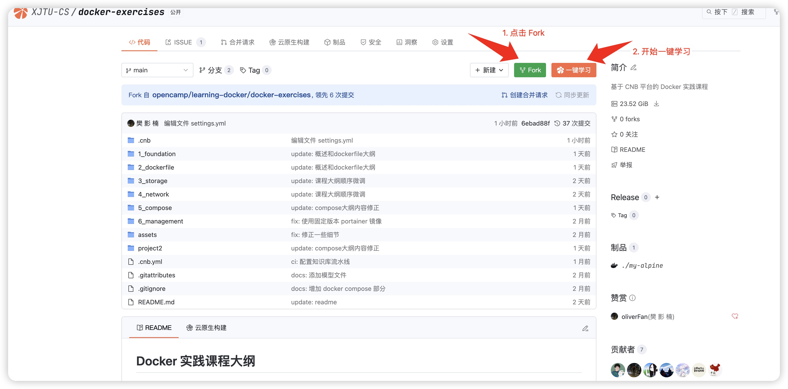

# Docker 实践课程大纲

学习者 Fork 本仓库后通过点击 “一键学习” 按钮，即可快速进入对应课程的实践环境，进行实时操作和验证。

# 第一阶段

## Docker基础

* 运行你的第一个容器 hello-world - 通过最简单的容器示例，快速理解 Docker 容器生命周期管理的基本操作
* 镜像和镜像仓库 - 深入掌握 Docker 镜像的拉取、管理技巧，以及公共/私有镜像仓库的配置使用方法
* 实践案例 - 运行 Alpine Linux 容器

动手实践：[Docker 基础](1_foundation/README.md)

## 自定义镜像之 Dockerfile 详解

* 从容器创建镜像 - 学习使用 docker commit 命令基于现有容器状态创建新镜像的方法
* 使用 Dockerfile 创建镜像 - 掌握通过声明式 Dockerfile 构建镜像的最佳实践，实现构建过程的可重复性
* 实践案例 - 使用 Dockerfile 构建一个 jupyter notebook 镜像
* 实践案例 - 使用多阶段构建来打包一个 golang 应用

动手实践：[自定义镜像之 Dockerfile 详解](2_dockerfile/README.md)

## 存储

* Docker 存储管理详解 - 通过 Volume 实现容器数据的持久化存储，保障数据安全性和可迁移性
* 实践案例 - 使用 Volume 部署 MySQL 数据库
* 实践案例 - 使用 Bind Mounts 运行 DeepSeek-R1

动手实践：[存储](3_storage/README.md)

## 网络

* Docker 网络管理详解 - 理解 Docker 网络驱动模型以及不同模型之间的区别
* 实践案例 - 使用自定义 Bridge 网络演示 Web 应用与 Redis 通信
* 实践案例 - 使用 Host 网络运行 Nginx 服务器
* 实践案例 - 使用 None 网络运行独立计算任务

动手实践：[网络](4_network/README.md)

## 容器编排之 Docker Compose

* 通过 YAML 文件定义多容器应用架构，实现服务依赖管理、统一配置和一站式启停操作
* 实践案例 - 使用 docker compose 构建 Todo 应用

动手实践：[容器编排之 Docker Compose](5_compose/README.md)

## Docker 容器监控与管理

* 容器管理基础 - 掌握容器生命周期管理、资源监控等常用命令
* 容器日志与调试 - 学习容器日志查看、问题诊断和调试技巧
* 实践案例 - 使用 Portainer 实现 Docker 环境的可视化管理和监控

动手实践：[Docker 容器监控与管理](6_management/README.md)

# 第二阶段

## 企业级开源项目实战

RAG 智能问答系统容器化实践

本项目是一个基于 RAG (Retrieval-Augmented Generation) 技术的智能问答系统，通过容器化技术实现系统的快速部署和扩展。系统集成了大语言模型、向量数据库、关系型数据库和对象存储等组件，展示了现代 AI 应用的基础架构。

动手实践：[项目](project/README.md)
