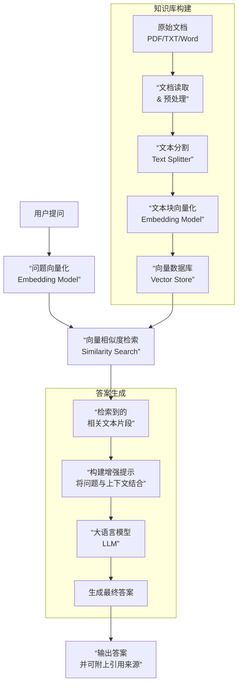

# RAG 智能问答系统容器化实践

## 项目简介

本项目是一个基于 RAG (Retrieval-Augmented Generation) 技术的个人知识库问答系统。
通过容器化技术实现系统的快速部署。
系统集成了大语言模型、向量数据库、关系型数据库和对象存储等多个服务，展示了现代 AI 应用的基础架构。

### 技术栈

- 前端：Next.js
- 后端：Python
- 大语言模型：DeepSeek / OpenAI
- 向量数据库：ChromaDB
- 关系型数据库：MySQL
- 对象存储：MinIO
- 容器编排：Docker Compose

## 项目目标

- 掌握 Dockerfile 的编写和最佳实践，学习容器间网络通信配置，掌握数据持久化方案
- 理解微服务架构的容器化部署，掌握服务间通信和依赖管理，掌握 Docker Compose 的使用，学习容器日志管理和监控

## 评分标准

学员根据给定项目的开发文档，书写服务镜像构建文件Dockerfile、服务编排docker-compose.yml,最终通用云原生开发一键启动项目;
最终提交包含dockerfile和docker-compose.yml的代码仓库地址用于项目评分。

## RAG 流程

### RAG 核心价值
- 减少模型“幻觉”：答案严格基于提供的事实性上下文，降低了LLM胡编乱造的可能性。
- 利用实时/私有知识：可通过更新向量数据库来让系统获取最新信息或企业内部知识，突破了LLM训练数据的时间限制和公开性限制。
- 答案可溯源：系统可以标注生成答案时所依据的文本片段，方便核查答案的准确性和可靠性。